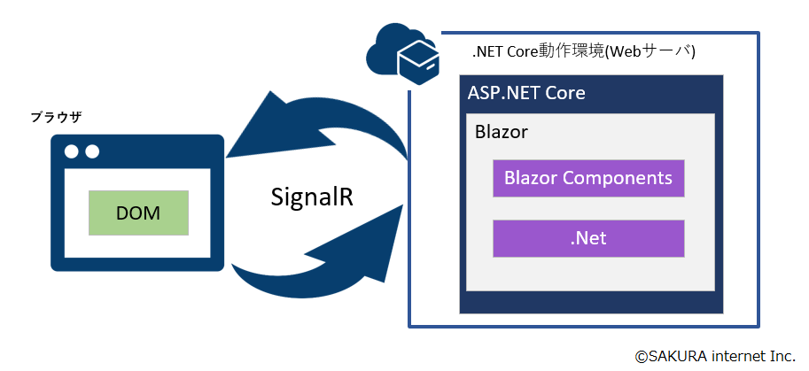
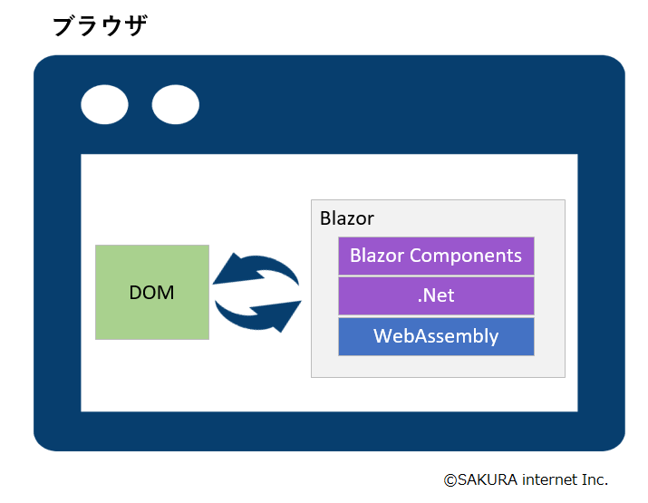

<a id="markdown-1-blazorについて-blazor概要編" name="1-blazorについて-blazor概要編"></a>
# 1. Blazorについて Blazor概要編

<!-- TOC -->

- [1. Blazorについて Blazor概要編](#1-blazorについて-blazor概要編)
  - [1.1. 概要](#11-概要)
  - [1.2. Blazor ServerとBlazor WebAssemblyについて](#12-blazor-serverとblazor-webassemblyについて)
    - [1.2.1. Blazor Server](#121-blazor-server)
    - [1.2.2. Blazor WebAssembly](#122-blazor-webassembly)
    - [1.2.3. (補足)WebAssemblyとは](#123-補足webassemblyとは)
  - [1.3. Blazorの今後](#13-blazorの今後)

<!-- /TOC -->

<a id="markdown-11-概要" name="11-概要"></a>
## 1.1. 概要
- BlazorはASP.NET Core(Microsoft)の１コンポーネントとして近年開発されているもの
  - ASP.NET CoreはWebアプリケーションを構築するための  
    オープンソースのクロスプラットフォーム フレームワーク  
    → つまるところ、どこのOSでもWebアプリケーションを構築・開発できますよということ
- Blazorの特徴としては、、、
  - Razor構文 + C#コードで構成された コンポーネント 単位で構成している
    - Razor構文とはASP.NETで用いられている、HTML形式のテンプレートを  
      表現するために使用されるマークアップ言語のこと  
      - Razor構文はなるべく開発者の手を煩わせないためにいたるところに配慮が行き届いており、  
      直感的に書きたいことを表現できてしまうのが特徴
      ```
      例えばHTMLで、入力用テキストボックスを定義するときは、

      <input id="name" maxlength="20" name="name" type="text" value="ほげほげ"/>
      
      こんな感じだが、Razor構文を用いると以下のように短縮できる
      
      @Html.TextBox("name","ほげほげ",new { maxlength = 20 })
      ```

  - Single Page Webアプリケーションを C# で開発できる点
    - 従来では HTML + javascript が主流だったが、Blazorではjavascriptの代わりにC#が利用できる  
      ※ ただし従来通りjavascriptも利用できる
    - なお、C#のコードをjavascriptへ変換しているのではなく、 .NETのバイナリが動く という点に注意
- 現在BlazorはBlazor Server(.NET Core 2.1～)と  
  Blazor WebAssembly(.NET Core 3.1～)の２種類存在している  
  → それぞれの違いについては後述

<a id="markdown-12-blazor-serverとblazor-webassemblyについて" name="12-blazor-serverとblazor-webassemblyについて"></a>
## 1.2. Blazor ServerとBlazor WebAssemblyについて
- Blazor ServerとBlazor WebAssemblyの違いはBlazorが動作する **場所** の違い

<a id="markdown-121-blazor-server" name="121-blazor-server"></a>
### 1.2.1. Blazor Server
- Blazor ServerではBlazorは.NET Coreが動作しているWEBサーバ上で動作する。
  - そのため、WEBサーバでは.NET Coreが動作している必要がある。
- 例えば、ブラウザからWEBアプリケーションを操作した時(ボタンを押すなどした時)は、、、
  1. ブラウザからサーバへUIイベントを送信
  2. サーバ上で送信されてきたUIイベントを元に処理を実行
  3. サーバからブラウザへ処理結果を返送
  4. ブラウザ上でサーバから返送された処理結果を元にUIを更新する
- なお、上記の ブラウザ ⇔ サーバ間の更新は SignalR を利用して実現している
  - SignalRはざっくりと説明すると ブラウザ ⇔ サーバ間を非同期で通信する仕組みのこと
- 簡単な図に表すと以下のような感じ  
  

<a id="markdown-122-blazor-webassembly" name="122-blazor-webassembly"></a>
### 1.2.2. Blazor WebAssembly
- Blazor WebAssemblyでは WebAssembly によりクライアントのブラウザ上でBlazorが動作する
  - もちろんWebAssemblyなので、クライアント側のブラウザ上ではビルドされた.NETコードが動作するため、  
    クライアント側には.NET Coreの動作環境は不要
- ブラウザで Blazor WebAssembly を開くと次の流れでアプリケーションが動作するようになります
  1. プログラムソースが.Netアセンブリによりコンパイルされる
  2. コンパイルしたアセンブリと.Netランタイムが ブラウザ にダウンロードされる
     - なお、この時ダウンロードされるモノのサイズはBlazor WebAssemblyにより自動調整される様子
  3. Blazor WebAssemblyによりダウンロードしてきたモノを構成しブラウザ上で動作するようにする
- 簡単な図に表すと以下のような感じ  


<a id="markdown-123-補足webassemblyとは" name="123-補足webassemblyとは"></a>
### 1.2.3. (補足)WebAssemblyとは
- ブラウザでプログラムを実行するための、  
  **「ブラウザ上で動作するバイナリコードの新しい仕様」**
- C , C++ , Rust , GoLang などのプログラミング言語でサポートが進められている

<a id="markdown-13-blazorの今後" name="13-blazorの今後"></a>
## 1.3. Blazorの今後
- マイクロソフトは今後、以下のような実験的プロジェクトとして開発する意向を今年１月に示している  
  ※2020/1/14 に開催されたオンラインインベント「.NET Conf Focus on Blazor」にて
  - PWA(ProgressiveWebApprication)を開発するための「Blazor PWA」
  - Electron等を用いてデスクトップアプリケーション開発するための「Blazor Hybrid」
  - ネイティブアプリケーションを開発するための「Blazor Native」
- 上記の発表のあったプロジェクトはまだ実験段階の位置付けとのこと
