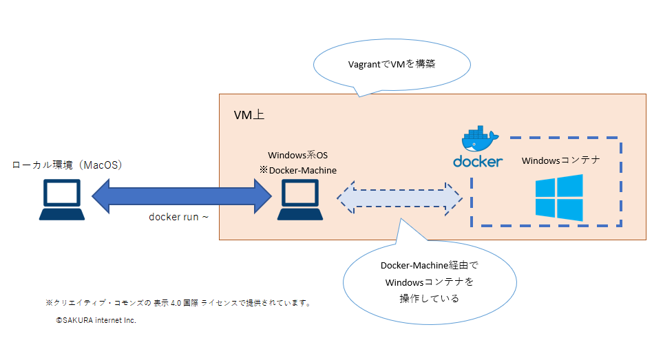
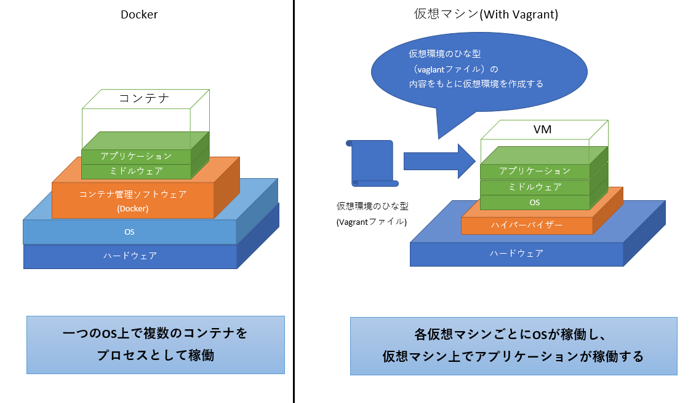
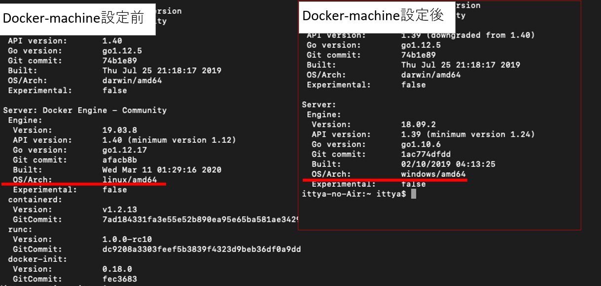
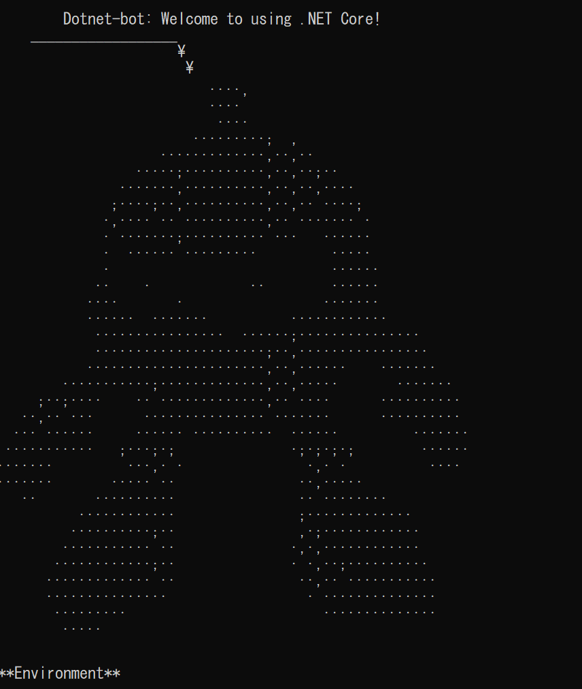

# MacOSでWindowsContainerを動かす
## 概要
- 当たり前ですが、原則 WindowsContainer(※) はWindows環境内でしか動作せず、  
  MacOSなどの非Windows環境ではWindowsContainerを動かすことができません。
  - (※).NET FrameworkやIIS、PowerShellなどの  
    　　Windows向けのプログラムを動作させることのできるコンテナのこと
- ですが、どうにかMacOS環境内で IIS を動かせないかと思案していたところ  
  GitHub上でお手軽な手法を公開している方がいらっしゃったので参考にさせていただきました
  - (参考)https://github.com/StefanScherer/windows-docker-machine
  
## どうやって実現しているのか
- タネをざっくりとまとめると。。。
  1. Vagrantを利用しMacOS上にWindows系OSのVMを用意
  1. 用意したWindows系OSのVMをDockerMachineとして設定する
  2. DockerMachineとして設定されたVM経由でDockerを操作することにより、  
     WindowsコンテナがMacOS上で操作できる
  

### (参考) DockerMachine
- もともとはWindows環境やMacOS環境でDockerを操作するために使われていたようです。
  - Docker Desctop For Windows/Mac がリリースする以前はDockerはLinux環境でしか利用できませんでした。
  - そのため、Window環境やMacOS環境でDockerを利用する場合はVMとしてLinux環境を用意し、  
    そのVMのLinux環境内でDockerを利用していたようです。
  - 上記の手法では手間がかかるため、Window環境やMacOS環境でDockerを利用しやすくするために  
    DockerMachineといった仕組みが生み出され、利用されていました。  
    → DockerMachineより前はboot2dockerという仕組みが利用されていたようです

### (参考) Vagrantとは
- 仮想化環境のひな型を作成／利用し、どこでも簡単に同じ仮想環境を作成できる仕組みのこと
- Dockerコンテナと非常に似ているような技術ですが、異なる技術なので注意
  

## 設定手順
- 実際にMacOS上にDockerMachineの設定を行い、  
  Windowsコンテナを動作するところまでを下記にまとめました
### 事前準備
1. Docker Desktop for Macのインストール
2. Gitのインストール
3. Homebrewのインストール
   - 以下のコマンドを管理者権限で実行する
      ```
      /usr/bin/ruby -e "$(curl -fsSL https://raw.githubusercontent.com/Homebrew/install/master/install)"
      ```
4. Homebrew-Caskのインストール
   - 以下のコマンドを実行する
      ```
      brew install cask
      ```
5. VagrantおよびVirtualBoxをHomebrew-Cask経由でインストール
   - 以下のコマンドを実行する
      ```
      brew cask install vagrant virtualbox
      ```
### DockerMachineの構築
- 今回Docker がインストールされた Windows Server 2016 を利用しました。
- 以下の3つのコマンドを順に実行する  
  ※ 3つ目のコマンドは初回実行時、ネット回線によってはお昼寝できるくらい長いので注意
  ```
  $ git clone https://github.com/StefanScherer/windows-docker-machine
  $ cd windows-docker-machine
  $ vagrant up 2016-box
  ```
### DockerMachineの確認
- 環境構築が完了すると 以下のように ``docker-machine ls`` で ``2016-box`` が出てきます。
  ```
  $ docker-machine ls
  NAME       ACTIVE   DRIVER    STATE     URL                        SWARM   DOCKER          ERRORS
  2016-box   -        generic   Running   tcp://192.168.99.90:2376           unknown   
  ```

- 上記の表示ができていれば、ひとまずOK

### DockerMachineでWindowsコンテナを実行する
1. まずはDockerMachineを利用する設定のために以下のコマンドで実行する
  ```
  $ eval $(docker-machine env 2016-box)
  ```
2. この時点で ``docker version`` の表示を見ると  
   ``Server`` の ``OS/Arch`` が ``windows/amd64`` となっています。
  
3. 以下のコマンドを実行し、丸っぽいキャラクターが表示されればOK
   ```
   docker run --rm microsoft/dotnet-samples:dotnetapp-nanoserver
   ```
   - こんなキャラクタ  
    
4. ちなみに、以下のコマンドを実行することにより、
   docker-machineを解除することができます。
    ```
    $ eval $(docker-machine env --unset)
    ```
## 最後に
- 設定手順等は以上となります。
  → MacOS上でサクッとまでは行きませんでしたが、  
  最初から最後までコンソール上で完結しているのは作業のしやすさは抜群です
- また、上記までの設定を行うことによりMacOS上でIISが動かせたりします
  → が、VMを経由してアクセスするような感じなので、
    これをMacのIPから直接アクセスできないか模索中です