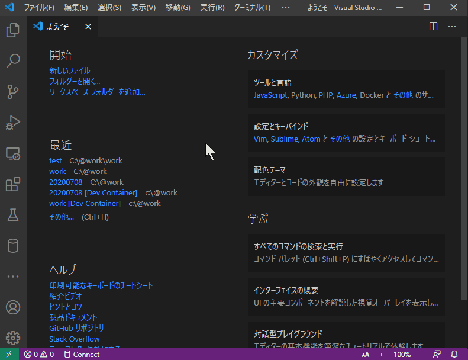
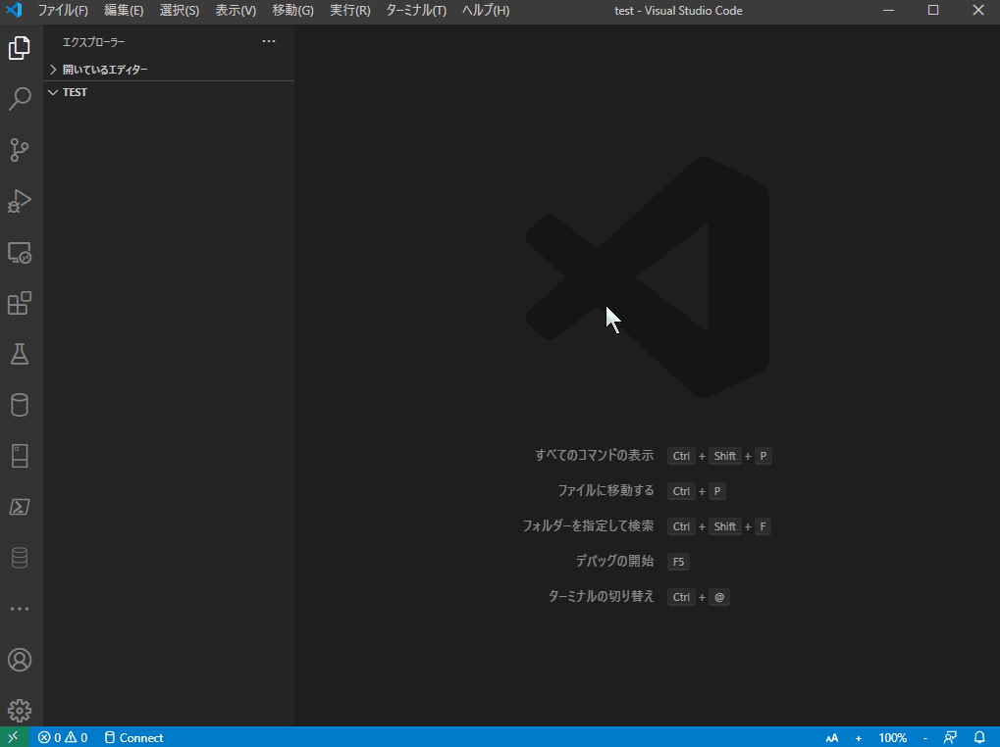
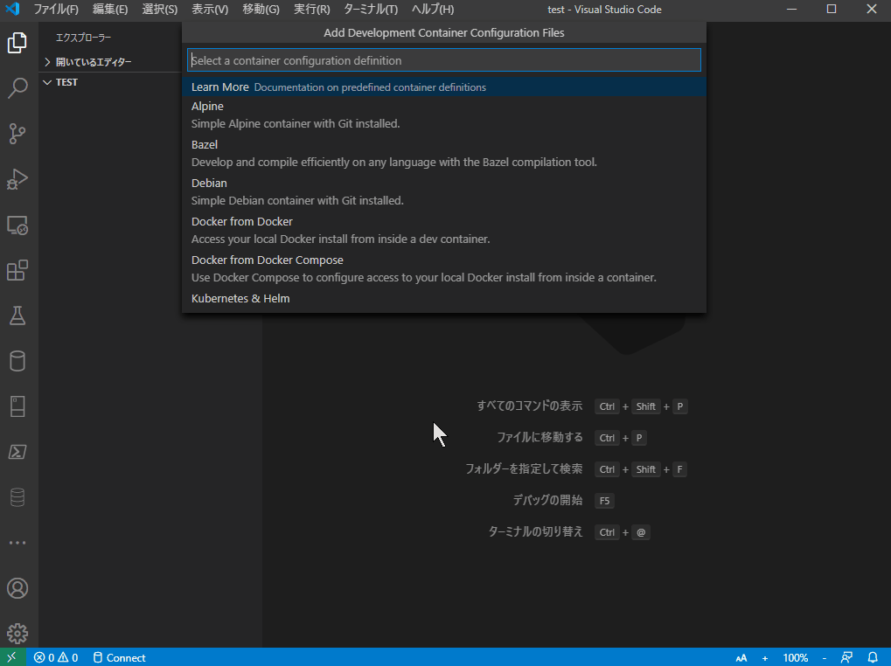
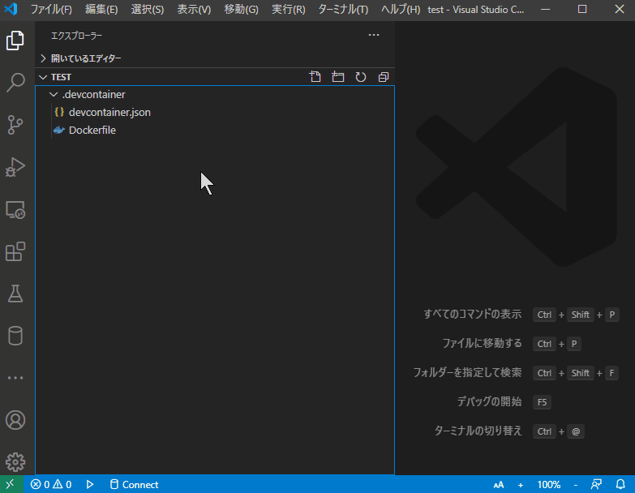
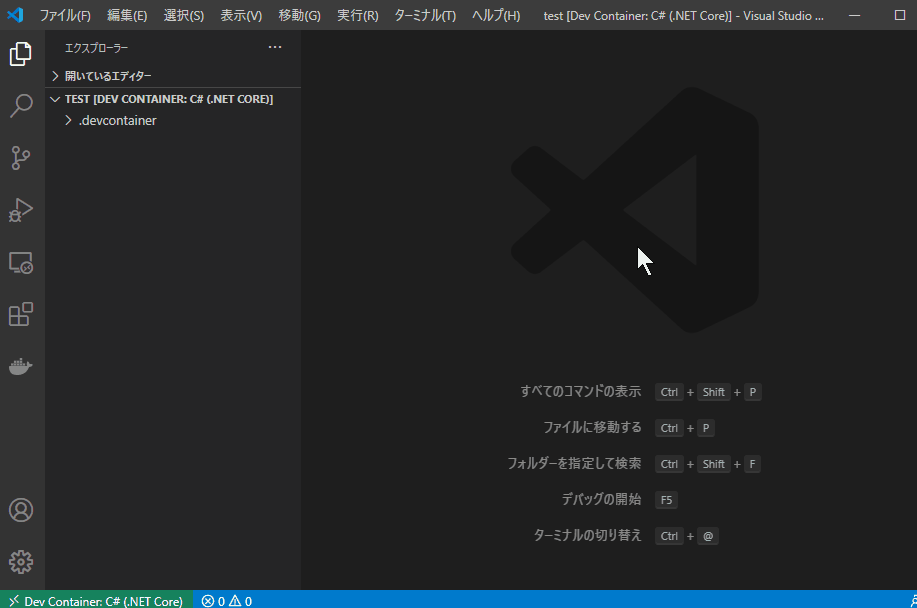
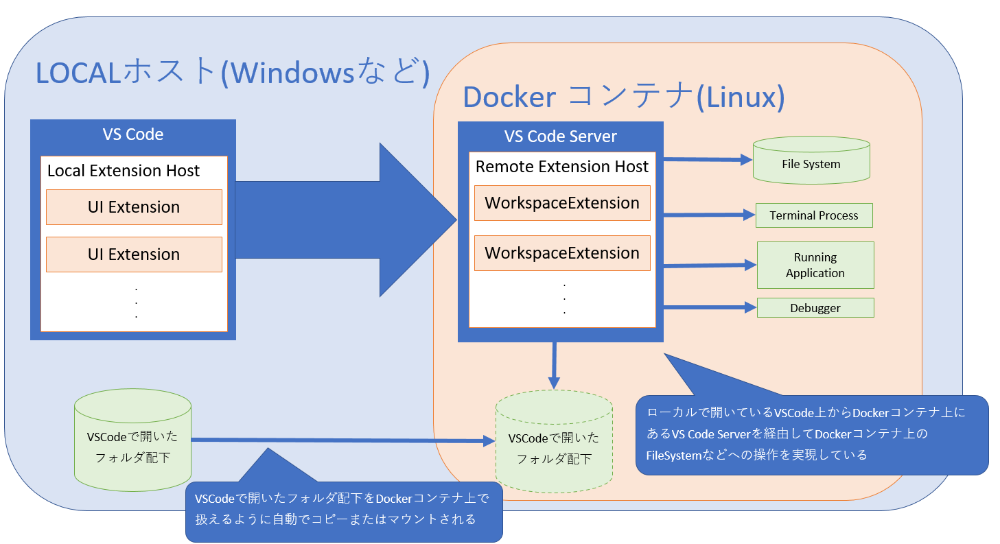

<a id="markdown-1-remote-developmentについて-環境準備編" name="1-remote-developmentについて-環境準備編"></a>
# 1. Remote Developmentについて ～環境準備編～
目次
<!-- TOC -->

- [1. Remote Developmentについて ～環境準備編～](#1-remote-developmentについて-環境準備編)
  - [1.1. 概要：Remote Developmentとは](#11-概要remote-developmentとは)
  - [1.2. 拡張機能「Remote Development」を使った環境準備手順](#12-拡張機能remote-developmentを使った環境準備手順)
    - [1.2.1. はじめに](#121-はじめに)
    - [1.2.2. 事前準備](#122-事前準備)
    - [1.2.3. 手順](#123-手順)
    - [1.2.4. Remote-Containers:Reopen In Container を実行した後、どういう状況なのか](#124-remote-containersreopen-in-container-を実行した後どういう状況なのか)
  - [1.3. まとめ](#13-まとめ)

<!-- /TOC -->

<a id="markdown-11-概要remote-developmentとは" name="11-概要remote-developmentとは"></a>
## 1.1. 概要：Remote Developmentとは
- MicroSoftから出ているVSCodeの拡張機能で、VSCode上でリモートや  
  DockerコンテナといったVSCodeを実行しているホスト環境とは  
  別の環境への接続を可能にする機能
  - これによりVSCodeでコードを書きつつ、プログラムの実行環境としては  
    コードを書いているホスト環境とはまた別の環境を利用することができるようになりました
- この拡張機能を利用することによって以下のメリットがあります
  - コードを作成する環境と実行する環境が切り分けられる(実行環境のサンドボックス化)
    - Dockerコンテナが元々持つメリットですが、これがなかなか強力
    - プロジェクト単位、機能単位で開発・実行環境を用意できるので  
      ホスト環境が次第に汚れていく煩わしさがなくなります。
  - 開発環境のテンプレート化
    - チームメンバの増員時に厄介なのが開発環境の構築
    - 今回紹介している拡張機能では、Dockerコンテナも利用できるので、  
      開発環境で必要な設定は全てDockerコンテナで準備しておくことで、  
      メンバ増員時にDockerコンテナで環境を準備してもらうことができます
    - またチームメンバの増員以外でも、チーム間の開発環境設定を統一することが可能です
- 拡張機能「Remote Development」は現在３つの機能を含んでいますが、  
  今回はその3つの機能の中で「Remote-Containers」を使って環境構築を行う様子を  
  使用例の一つとして記載します


<a id="markdown-12-拡張機能remote-developmentを使った環境準備手順" name="12-拡張機能remote-developmentを使った環境準備手順"></a>
## 1.2. 拡張機能「Remote Development」を使った環境準備手順
<a id="markdown-121-はじめに" name="121-はじめに"></a>
### 1.2.1. はじめに
- 今回はC#やVB.NETなど .NET系のアプリケーションが開発・デバッグできる環境を  
  作成していきます。(※[.NET Core SDK 3.1] が利用可能な環境を構築します。) 
- なお、環境構築には、DockerHub等で提供されているDockerイメージも利用できますが、  
  今回は拡張機能「Remote Development」が提供しているテンプレートがあるので  
  そちらを使って [.NET Core 3.1] の環境を準備します。  
  → DockerHubなどにあるDockerイメージを使った環境構築はまた後程ご紹介します。
<a id="markdown-122-事前準備" name="122-事前準備"></a>
### 1.2.2. 事前準備
- まずは拡張機能「Remote Development」を利用する前に  
以下のソフトウェア(+拡張機能)をインストールしてください
  1. Docker For ×××(Windows/Mac)
  2. Visual Studio Code
  3. Visula Studio Codeの拡張機能としてRemote Development  
- また、インターネット上からDockerイメージをダウンロードする都合上、  
  拡張機能を利用する環境ではインターネットへの接続がある状況で実施してください
<a id="markdown-123-手順" name="123-手順"></a>
### 1.2.3. 手順
1. VSCodeを開き、適当なフォルダをVSCodeで開く。  
   
2. VSCodeの上部にあるメニュー [表示] → [コマンドパレット] から  
  コマンドパレットを表示し、以下のコマンドを実行する  
    ```
    Remote-Containers:Add Development Container Configuration Files...
    ```  
    ※下のGifでは、Remote-Containers:Addまで入力して出てきた候補をクリックしています  
  
3. 2.で実行した後出てきた候補から [Show All Definitions...] を選択し、  
   検索ボックスで「C#」と入力して出てきた [C#(.NET Core)]を選択する  
  
4. VSCodeの上部にあるメニュー [表示] → [コマンドパレット] から  
  コマンドパレットを表示し、以下のコマンドを実行する  
    ```
    Remote-Containers:Reopen In Container
    ```  
    ※下のGifでは、Remote-Containers:Reopenまで入力して出てきた候補をクリックしています  
  
5. VSCodeの左下の緑色部分が「リモートを開いています...」から  
   「Dev Container:C#(.NET Core)」に表示が変われば準備完了
6. VSCodeの上部メニュー [ターミナル] → [新しいターミナル] を開いて、  
   以下のコマンドを実行し、.NET Core SDK 3.1 が利用可能であることを確認する
   ```
   dotnet --version
   ```
   ※ VSCodeのターミナルを通してその環境のターミナルを利用することができます。  
      → 現在はDockerコンテナに接続中なので、Dockerコンテナ上のターミナルを利用できます。  
    　　仮に 手順1 の段階でターミナルを起動するとローカルの環境のターミナルが利用できます。  
    　　(Windows環境ならば、Powershellもしくはコマンドライン)  
   ※ また上記のコマンドは .NET Core SDK のどのバージョンがインストールされているかを確認するコマンドです  
  

→ コマンドの実行結果が3.1.301になっているということは、.NET Core SDK 3.1.301が  
　インストールされているということ！(2020-06-09にReleaseされた最新版)

<a id="markdown-124-remote-containersreopen-in-container-を実行した後どういう状況なのか" name="124-remote-containersreopen-in-container-を実行した後どういう状況なのか"></a>
### 1.2.4. Remote-Containers:Reopen In Container を実行した後、どういう状況なのか
- まず、ローカル環境内ではこの時点で、Dockerコンテナが起動し立ち上がっている状態にあります
  - コマンドを実行した直後に[.devcontainer]フォルダ配下の  
    [devcantainer.json]ファイルを読込み、読込んだ設定内容を  
    元にDockerイメージの読み込みやDockerコンテナに対する設定を反映しています。
  - 今回の例だと、.NET Core SDK3.1.301 が入ったLinuxコンテナが起動している
- また、起動したコンテナに対してVSCode上から操作できるようになっています。
  - もちろんDockerコンテナで立ち上がっているので、  
    Docker For ××× を用いた接続も可能
- ちなみに [手順１] で開いたフォルダ配下はDockerコンテナに対して  
  自動でコピー(またはマウント)されるので、ローカル ⇔ Dockerコンテナへの  
  ファイルのやり取りがシームレスに行えるのも本拡張機能の長所の一つ
- 大雑把な図解は次の通り
    


<a id="markdown-13-まとめ" name="13-まとめ"></a>
## 1.3. まとめ
- 今回はVSCodeの拡張機能「RemoteDevelopment」についてほんの一部分について記載しました
- 今後は個人的な勉強もかねて様々な使用例を紹介していきたいと考えています。
